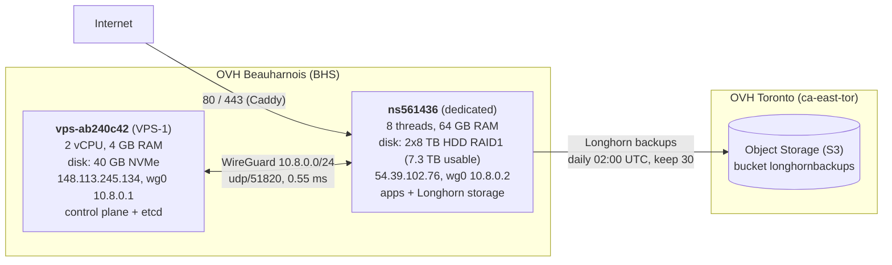

# k8s infrastructure

## Introduction

This repository contains the infrastructure configuration for my Kubernetes cluster, including all the manifests and documentation.

Table of contents:
* [🚀 Apps](#-Apps)
* [📜 Wiki](#-Wiki)
* [⚒️ Setup](#-Setup)

### 🦙 Sylvain

Even with all this documentation, your only possible solution to fix a deployment issue may be to ask Sylvain for help. Your best hope is probably to find him at AGEPOLY late enough in the evening so that he's not 100% busy, but also just before he starts playing babyfoot. This requires a good sense of timing.

### 🚧 One day...

Because nothing is ever perfect, here is a list of things that need to be done. Sorted by priority.

* setup pgbackrest for critical databases backups.
* understand how to apply values from a `common.yaml` file to several `kustomization.yaml` files.
* use more config maps instead of config PVCs.

## 🚀 Apps

* **Pro**: This namespace is for all the services hosted for me as a freelancer, such as Umami, HasteServer, Blog, DDPE, Diswho, Instaddict.
* **Home**: This namespace is for all the services hosted for my personal use such as Vaultwarden, TimeTagger, Immich, Monica, Mealie, FileBrowser.
* **Managed**: This namespace is for all the services hosted for my clients.
* **Sushiflix**: This namespace is for all media services such as Plex, Radarr, Sonarr, Bazarr, Jackett, Qbittorrent, Sabnzbd, Tautulli, Overseerr.
* **DB**: This namespace is for all the databases such as PostgreSQL, PgAdmin4.
* **Workflows**: This namespace is for all the workflows such as Harbor.
* **Monitoring**: This namespace is for all the monitoring services such as Grafana, Prometheus, Alertgram, Promtail and Loki.
* **Backups**: One snapshot of each volume is taken every 30 minutes, and a backup is sent to a S3 bucket every night. The retention policy is 7 days for snapshots and 30 days for off-site backups. Movies and TV shows are not backed up, considered as non-critical data.

## 📜 Wiki

### Postgres roles

Each app in the shared `db/postgresql` connects with its own role, scoped to its own database(s). Never use the `postgres` superuser from a workload.

| Role        | Used by |
|-------------|---------|
| `bots`      | All `managed/*` Discord bots |
| `haste`     | `pro/haste-server` |
| `umami`     | `pro/umami-analytics` |
| `monica`    | `home/monica` |
| `shlink`    | `home/shlink` |
| `paperless` | `home/paperless` |
| `bonds`     | `home/bonds` |

### Create a new sealed secret

Create a new secret (the simplest way is to use `stringData`).

```yaml
apiVersion: v1
kind: Secret
metadata:
  name: my-app-secret
  namespace: {NAMESPACE_NAME} # IMPORTANT
type: Opaque
stringData:
  username: martin007
  password: mOnSuper1M0t2pass
  code-secret: "1234 5678 9101"
```

Encrypt the secret.

```sh
kubeseal --scope namespace-wide --cert https://raw.githubusercontent.com/Androz2091/k8s-infrastructure/main/sealed-secrets.crt -o yaml < secrets.yaml > sealed-secrets.yaml
```

### Port forward (to a service or a pod)

```sh
kubectl -n somenamespace port-forward svc/someservice host-port:cluster-port`
```

### Internal-only services (port-forward to access)

Cluster-admin and DB-direct services that stay off the public internet. Port-forward them locally to access:

| Service | URL after forwarding | Command |
|---|---|---|
| Argo CD | http://localhost:8080 | `kubectl -n argocd port-forward svc/argocd-server 8080:80` |
| pgAdmin | http://localhost:8081 | `kubectl -n db port-forward svc/pgadmin-pgadmin4 8081:80` |

### Enter a pod

```sh
kubectl -n somenamespace exec --stdin --tty somepod -- /bin/bash
```

### Preview manifests created by Helm charts

```sh
helm template my-app repo-url/app -f values.yaml
```

Same applies for `kustomization.yaml` files:

```sh
kubectl kustomize --enable-helm .
```

#### Disable backups for a specific volume

By default longhorn backups all volumes. Sometimes, for movies or other non-critical data, we don't want to backup the volume. In that case, you should add these labels to the volume:

```sh
labels:
    recurring-job-group.longhorn.io/nobackup: enabled
    recurring-job.longhorn.io/source: enabled
```

### Expand a Longhorn volume

Use port forwarding to access the Longhorn UI. ⚠️ First, sync the new PVC with Argo before expanding on Longhorn UI (or you will get a sync failed - `Forbidden: field can not be less than previous value`). Then delete all deployments using the volume. Then expand it via Longhorn UI.

### Seal a secret

From a `secrets.yaml` file:

```sh
kubeseal --scope namespace-wide --cert ../../../sealed-secrets.crt -o yaml < secrets.yaml > sealed-secrets.yaml
```

Raw from a file:

```sh
kubeseal --scope namespace-wide --cert ../../../sealed-secrets.crt --raw --from-file=config.json
```

⚠️ Onechart does not support `--scope namespace-wide` yet, make sure to use `cluster-wide` instead when using `sealedFileSecrets`.

### Unseal a secret

```sh
kubeseal --recovery-unseal --recovery-private-key ~/private.key -o yaml < sealed-secrets.yaml
```

### Add a TimeTagger user

Generate a `user:hash` pair on <https://timetagger.app/cred>. ⚠️ The page escapes `$` as `$$` for docker-compose: use a single `$` here (`$2a$08$...`, 60 characters), or the login fails.

Append it (comma-separated) to `TIMETAGGER_CREDENTIALS` in `cluster-manifests/home/timetagger/secrets.yaml`, [seal the secret](#seal-a-secret), merge, then restart the pod once ArgoCD has synced (env vars are only read at startup):

```sh
kubectl -n home rollout restart deploy/timetagger
```

### Upgrade Umami

Umami runs Prisma migrations on container startup. Long data backfills (such as `09_update_hostname_region` which copies hostname from `session` to `website_event`) can be killed by the startup probe, leaving `_prisma_migrations` rows marked failed and a partially applied schema. Future Prisma startups then refuse to proceed with error `P3009`.

Before bumping the chart, scale the deployment to 0 and run any data-heavy migration as a one-shot pod so it cannot be killed by probes:

```sh
kubectl -n pro scale deploy umami-analytics --replicas=0
DB_URL=$(kubectl -n pro get secret umami-analytics-secrets -o jsonpath='{.data.DATABASE_URL}' | base64 -d)
kubectl run umami-migrate --rm -it -n pro \
  --image=ghcr.io/umami-software/umami:postgresql-vX.Y.Z \
  --restart=Never --env="DATABASE_URL=$DB_URL" \
  --command -- npx prisma migrate deploy
kubectl -n pro scale deploy umami-analytics --replicas=1
```

If a previous attempt left a failed migration, inspect schema state by hand (columns, indexes, `_prisma_migrations` rows), finish any missing SQL manually, then mark the migration applied with `npx prisma migrate resolve --applied <migration_name>` from the same one-shot pod.

### Setup Sushiflix

The Plex server has to be accessed locally to be claimed. Use port forwarding to access it first. Then we need to specify the custom domain name in the server network settings (advanced), and specify `plex.androz2091.fr`. Otherwise it will try to load data from `server-ip:32400` or even `cluster-ip:32400` which is not securely accessible.

### View logs

Logs are collected by Promtail/Loki and can be access via the dashboard available at [grafana/loki-dashboard.json](./grafana/loki-dashboard.json).

⚠️ Onechart labels all its apps with `onechart` so we have to differentiate them using the `instance` label.

## ⚒️ Setup

### Create the k8s cluster

```sh
apt update && sudo apt upgrade -y
apt-get install -y software-properties-common curl jq
```

Turn off swap.

```sh
swapoff -a
systemctl mask dev-sdb?.swap && systemctl stop dev-sdb?.swap # Debian special, check dans htop`
```

Prepare the node with Ansible: SSH hardening, host firewall, kernel modules and sysctl, WireGuard link, CRI-O and Kubernetes (versions pinned in the playbook's `vars`, packages held). It stops **before** `kubeadm init/join`; Kubernetes + ArgoCD own everything in-cluster. [`ansible/inventory.ini`](./ansible/inventory.ini) lists the machines; [`ansible/bootstrap.yaml`](./ansible/bootstrap.yaml) runs on **all** of them, production included (`--limit <host>` for one), and refuses to run if swap is on. Always `--check --diff` first. Tasks are idempotent: a second run must report `changed=0`.

```sh
brew install ansible
ansible -i ansible/inventory.ini all -m ping                                              # SSH + Python ok?
ansible-playbook -i ansible/inventory.ini ansible/bootstrap.yaml --check --diff           # dry run, changes nothing
ansible-playbook -i ansible/inventory.ini ansible/bootstrap.yaml --diff                   # bare Debian 12 -> ready node
ansible-playbook -i ansible/inventory.ini ansible/bootstrap.yaml --limit apps --diff      # one host or group
ansible-playbook -i ansible/inventory.ini ansible/bootstrap.yaml --tags firewall --diff   # one step: ssh | firewall | kernel | wireguard | packages
```

`ns561436` was built by hand with the equivalent commands (see this file's git history) and brought under the playbook on 2026-09-21. Done by hand first, because Ansible's apt tasks fail on any broken source (`apt-get` only warns): the old `kubernetes.list`/`cri-o.list` with their keyrings (the same repo declared twice with different keys is an apt error) and the dead Helm repo (`baltocdn.com`, retired in 2025) were moved to `/root/apt-legacy/`, and `apt-mark manual conntrack ebtables` keeps `apt autoremove` away from them.

Create the cluster.

```sh
kubeadm init --pod-network-cidr=10.244.0.0/16
```

Configure kubectl CLI to connect to the cluster.

```sh
export KUBECONFIG=/etc/kubernetes/admin.conf
```

Allow the current (single) node to be a worker node.

```sh
kubectl taint nodes --all node-role.kubernetes.io/control-plane-
```

### Install a CNI plugin

```sh
kubectl apply -f https://raw.githubusercontent.com/coreos/flannel/master/Documentation/kube-flannel.yml
```

### Install Caddy

```sh
sudo apt install -y debian-keyring debian-archive-keyring apt-transport-https curl
curl -1sLf 'https://dl.cloudsmith.io/public/caddy/stable/gpg.key' | sudo gpg --dearmor -o /usr/share/keyrings/caddy-stable-archive-keyring.gpg
curl -1sLf 'https://dl.cloudsmith.io/public/caddy/stable/debian.deb.txt' | sudo tee /etc/apt/sources.list.d/caddy-stable.list
sudo apt update
sudo apt install caddy
```

Start Caddy (execute this command in the directory where the `Caddyfile` is located).

```sh
sudo caddy start
```

### Install Helm

```sh
curl https://baltocdn.com/helm/signing.asc | sudo apt-key add -
sudo apt-get install apt-transport-https --yes
echo "deb https://baltocdn.com/helm/stable/debian/ all main" | sudo tee /etc/apt/sources.list.d/helm-stable-debian.list
sudo apt-get update
sudo apt-get install helm
```

### Install Sealed Secrets

```sh
helm repo add sealed-secrets https://bitnami-labs.github.io/sealed-secrets
helm repo update
helm install sealed-secrets sealed-secrets/sealed-secrets --namespace kube-system --create-namespace --version 2.16.1
```

Install the CLI.

```sh
# Fetch the latest sealed-secrets version using GitHub API
KUBESEAL_VERSION=$(curl -s https://api.github.com/repos/bitnami-labs/sealed-secrets/tags | jq -r '.[0].name' | cut -c 2-)

# Check if the version was fetched successfully
if [ -z "$KUBESEAL_VERSION" ]; then
    echo "Failed to fetch the latest KUBESEAL_VERSION"
    exit 1
fi

curl -OL "https://github.com/bitnami-labs/sealed-secrets/releases/download/v${KUBESEAL_VERSION}/kubeseal-${KUBESEAL_VERSION}-linux-amd64.tar.gz"
tar -xvzf kubeseal-${KUBESEAL_VERSION}-linux-amd64.tar.gz kubeseal
sudo install -m 755 kubeseal /usr/local/bin/kubeseal
```

Create a public and private key.

```sh
export PRIVATEKEY="mytls.key"
export PUBLICKEY="mytls.crt"
export NAMESPACE="kube-system"
export SECRETNAME="sealed-secrets-customkeys"
```

⚠️ You may want to change the number of days for the expiration date.
```sh
openssl req -x509 -days 365 -nodes -newkey rsa:4096 -keyout "$PRIVATEKEY" -out "$PUBLICKEY" -subj "/CN=sealed-secret/O=sealed-secret"
```

Create the secret.

```sh
kubectl -n "$NAMESPACE" create secret tls "$SECRETNAME" --cert="$PUBLICKEY" --key="$PRIVATEKEY"
kubectl -n "$NAMESPACE" label secret "$SECRETNAME" sealedsecrets.bitnami.com/sealed-secrets-key=active
```

Delete the sealed-secrets controller pod to refresh the keys.

```sh
kubectl -n "$NAMESPACE" delete pod -l name=sealed-secrets-controller
```

See [bitnami-labs/sealed-secrets](https://github.com/bitnami-labs/sealed-secrets/blob/main/docs/bring-your-own-certificates.md#generate-a-new-rsa-key-pair-certificates).

### Install ArgoCD

```sh
kubectl create namespace argocd
helm repo add argo https://argoproj.github.io/argo-helm
helm repo update
helm install argocd argo/argo-cd --namespace argocd --create-namespace --values https://raw.githubusercontent.com/Androz2091/k8s-infrastructure/main/argocd-values.yaml --version 7.0.0
```

CLI de argo.

```sh
sudo curl -sSL -o /usr/local/bin/argocd https://github.com/argoproj/argo-cd/releases/latest/download/argocd-linux-amd64 sudo chmod +x /usr/local/bin/argocd
```

Get ArgoCD password.

```sh
kubectl -n argocd get secret argocd-initial-admin-secret -o jsonpath="{.data.password}" | base64 -d; echo
```

### Install Longhorn

```sh
apt-get install open-iscsi -y
helm repo add longhorn https://charts.longhorn.io
helm repo update
helm install longhorn longhorn/longhorn --namespace longhorn-system --create-namespace --version 1.7.0
```

(optional) forward the Longhorn UI to the host.

```sh
kubectl -n longhorn-system port-forward svc/longhorn-frontend 8080:80
```

todo /var/lib/longhorn

### Execute bootstrap application

```sh
kubectl apply -f https://raw.githubusercontent.com/Androz2091/k8s-infrastructure/main/bootstrap-app.yaml
```

### Use k8s cluster DNS on the host

Disable `systemd-resolved` if it's running.

```sh
sudo systemctl disable systemd-resolved.service
sudo systemctl stop systemd-resolved.service
mv /etc/resolv.conf /etc/resolv.conf.bak
```

* update `/etc/resolv.conf` as follows:
```sh
nameserver 8.8.8.8
nameserver 10.96.0.10
```

Now we also need to update the cluster DNS so it does not loop back to the host.

* dump the current CoreDNS config:
```sh
kubectl -n kube-system get configmap coredns -o yaml > coredns_patched_dns.yaml
```

* edit the `coredns_patched_dns.yaml` file and add the following line to the `Corefile`:
```
forward . 1.1.1.1 8.8.8.8 {
	max_concurrent 1000
}
```

* then apply the changes by running:
```sh
kubectl apply -f coredns_patched_dns.yaml
```

### Create a secret to pull from Harbor

Do not forget the `\` before the `$` in the username.

```sh
kubectl -n managed create secret docker-registry regcred --docker-server=harbor.androz2091.fr --docker-username="robot\$name" --docker-password="secret_token"
```

### Configure longhorn backups (blackblaze)

From the Longhorn UI, go to `Settings` > `Backup Target` and add a new target with the following settings:

```sh
s3://<bucket_name>@s3.us-west-004.backblazeb2.com/<path>
```

Create a new secret with the credentials.

```sh
kubectl create secret generic s3-secret --from-literal=AWS_ACCESS_KEY_ID=<access_key> --from-literal=AWS_SECRET_ACCESS_KEY=<secret_key> --from-literal=AWS_ENDPOINTS=s3.us-west-004.backblazeb2.com -n longhorn-system
```

A **snaphost** is the state of a Kubernetes Volume at any given point in time. It's stored in the cluster.
A **backup** is a snapshot that is stored outside of the cluster. It's stored in the backup target (here backblaze).

### Control Plane Node

🚧 In progress: the control plane (API server, etcd, scheduler, controller-manager) is moving from the dedicated server to a small NVMe VPS. Apps and Longhorn storage stay on the dedicated server.

**Why**: etcd waits for a disk sync (`fdatasync`) on every write and needs p99 < 10 ms. On the HDD RAID1, shared with Longhorn and Loki, it can't get that, so the scheduler and controller-manager lose their leader election and restart (340+ restarts each).

| WAL sync latency | `ns561436` (HDD, 4.5M real etcd syncs over 18 days) | `vps-ab240c42` (NVMe, fio, 2026-09-20) |
|---|---|---|
| median | 8–16 ms | 0.55 ms |
| p99 | 128–256 ms | 0.87 ms |
| worst | > 8 s (384 times) | 2.8 ms |

Target architecture:



Progress:

- [x] Order the VPS (OVH VPS-1 2027, Beauharnois, Debian 12, no commitment, 5.39 €/month incl. VAT)
- [x] SSH access with key only
- [x] Check the disk latency
- [x] System updates
- [x] Firewall on the VPS ([`firewall/vps-ab240c42.nft`](./firewall/vps-ab240c42.nft))
- [x] Harden `ns561436`: SSH keys only, public VXLAN 8472 closed ([`firewall/ns561436.nft`](./firewall/ns561436.nft))
- [ ] Full default-drop firewall on `ns561436` (after WireGuard)
- [x] Kernel modules, CRI-O and Kubernetes packages ([`ansible/bootstrap.yaml`](./ansible/bootstrap.yaml), same versions as `ns561436`, no `kubeadm init`)
- [x] WireGuard link between the two machines ([WireGuard](#wireguard)); the cluster does not use it yet
- [ ] Fix the pod CIDR (`ns561436` owns `10.244.1.0/16`, which is the whole Flannel range, so a second node can't get a subnet)
- [x] etcd snapshot, `/etc/kubernetes/pki` backup and rollback plan ([etcd backup and rollback](#etcd-backup-and-rollback)); take a fresh snapshot right before touching etcd
- [ ] Stable `controlPlaneEndpoint` and API server certificate SANs, then join the VPS as a control plane node
- [ ] Move etcd to the VPS and remove the control plane from `ns561436`

#### SSH access

The user is `debian` (passwordless sudo). Host key: `SHA256:ntDgt0UwHZ7QIxj+q6JYZWXBYysPiHcyJ3PnKZ/TlJE` (ED25519).

```sh
ssh -i ~/.ssh/mbp2024 debian@148.113.245.134
```

Done once: log in with the temporary password from the OVH email (it forces a password change) and install the key. The playbook (`--tags ssh`) then turns passwords off on every node with `/etc/ssh/sshd_config.d/00-hardening.conf` (keys only, 20 s to log in, 3 half-open connections per IP).

```sh
ssh-copy-id -i ~/.ssh/mbp2024.pub debian@148.113.245.134
sudo sshd -T | grep -i '^passwordauthentication' # what sshd really enforces: no
```

sshd keeps the FIRST value it reads and OVH's `50-cloud-init.conf` says "yes", so the override must sort before it. `PasswordAuthentication no` in the main `sshd_config` is not enough: `ns561436` was effectively accepting password logins that way until 2026-09-21 (~1000 guesses and ~170 dropped connections per hour, both 0 since).

#### Check the disk latency for etcd

Simulates the etcd write pattern (small writes, each followed by `fdatasync`). Read the `99.00th` value of the `fsync/fdatasync` block: it must be under 10 ms (10000 usec).

```sh
sudo apt-get install -y fio
mkdir -p ~/fio-test && fio --name=etcd-sim --directory=$HOME/fio-test --rw=write --ioengine=sync --fdatasync=1 --size=22m --bs=2300
rm -rf ~/fio-test
```

⚠️ Don't run it on `ns561436`: it competes with etcd for the HDD. Read etcd's own histogram instead (cumulative since etcd started).

```sh
curl -s http://127.0.0.1:2381/metrics | grep etcd_disk_wal_fsync_duration_seconds_bucket
```

#### System updates

`full-upgrade` and not `upgrade`: a new kernel is a new package, which `apt-get upgrade` refuses to install. Debian security patches are then applied automatically by `unattended-upgrades` (it never reboots by itself, and never touches the held Kubernetes packages).

```sh
sudo apt-get update && sudo apt-get -y full-upgrade
sudo reboot # only needed for a new kernel, check with uname -r
```

#### Firewall

Rules are version-controlled under [`firewall/`](./firewall/) (one file per node) so a node rebuild is reproducible. Each node needs the `nftables` package; each file manages only its own table, so it never clears the rules kube-proxy and Flannel install in the same kernel engine (no `flush ruleset`).

Done on both nodes by [the playbook](#create-the-k8s-cluster) (`--tags firewall`), which replaces Debian's default `/etc/nftables.conf` (it starts with `flush ruleset`). By hand it is:

```sh
sudo apt-get install -y nftables
sudo cp firewall/<node>.nft /etc/nftables.conf   # the file for that node
sudo nft -c -f /etc/nftables.conf                # check syntax (no output = ok)
sudo nft -f /etc/nftables.conf                   # apply now (keep your SSH session open)
sudo systemctl enable nftables                   # load at every boot
```

| File | Node | Policy |
|---|---|---|
| `firewall/vps-ab240c42.nft` | control plane VPS | default-drop; allows SSH, ping, DHCP |
| `firewall/ns561436.nft` | dedicated server | default-accept; only drops Flannel's public VXLAN (8472) |

`ns561436` stays default-accept for now because it runs production; VXLAN (8472) is unauthenticated and needs no public exposure on a single node. Reopen it only from the WireGuard peer once the VPS joins, then tighten to a full default-drop firewall.

#### WireGuard

Private link between the nodes: `wg0` on `10.8.0.0/24` (VPS `10.8.0.1`, `ns561436` `10.8.0.2`), udp/51820, MTU 1420, ~0.55 ms. The VPS firewall only accepts 51820 from `54.39.102.76`. The cluster does not use it yet: node IPs are still the public ones.

No secret is in this repo. Each node generates its own private key, which never leaves it; public keys and tunnel addresses are host vars in [`ansible/inventory.ini`](./ansible/inventory.ini), and [`ansible/templates/wg0.conf.j2`](./ansible/templates/wg0.conf.j2) makes WireGuard load the private key from its file (`PostUp`), so the config holds no secret either.

```sh
# once per node, as root. Running it again replaces the key and breaks the tunnel.
umask 077; wg genkey | tee /etc/wireguard/privatekey | wg pubkey > /etc/wireguard/publickey
cat /etc/wireguard/publickey   # -> wg_public_key in ansible/inventory.ini

ansible-playbook -i ansible/inventory.ini ansible/bootstrap.yaml --tags "wireguard,firewall" --diff
ping -c 3 10.8.0.2 && sudo wg show wg0   # from the VPS: recent handshake, transfer counters going up
```

#### etcd backup and rollback

Taken before any change to `ns561436`. The files hold every Secret in readable form (no encryption at rest) and the cluster CA keys: `chmod 600`, never in this repo. Copies: `ns561436:/root/cluster-backup`, `vps-ab240c42:~/cluster-backup`, and the admin's Mac (`~/cluster-backup`, outside iCloud-synced folders).

```sh
# on ns561436. etcdctl/etcdutl only exist inside the etcd container, which only sees /var/lib/etcd and /etc/kubernetes/pki/etcd
D=$(date +%F); mkdir -p /root/cluster-backup && chmod 700 /root/cluster-backup
ETCD="kubectl --kubeconfig=/etc/kubernetes/admin.conf -n kube-system exec etcd-ns561436 --"
$ETCD etcdctl --endpoints=https://127.0.0.1:2379 --cacert=/etc/kubernetes/pki/etcd/ca.crt \
  --cert=/etc/kubernetes/pki/etcd/healthcheck-client.crt --key=/etc/kubernetes/pki/etcd/healthcheck-client.key \
  snapshot save /var/lib/etcd/snapshot-$D.db
$ETCD etcdutl snapshot status /var/lib/etcd/snapshot-$D.db -w table
mv /var/lib/etcd/snapshot-$D.db /root/cluster-backup/
# certificates, control plane manifests, kubeconfigs (tmp/ = 444 MB of stale kubeadm upgrade backups)
tar czf /root/cluster-backup/etc-kubernetes-$D.tar.gz --exclude=kubernetes/tmp -C /etc kubernetes
cd /root/cluster-backup && chmod 600 *.db *.tar.gz && sha256sum *.db *.tar.gz | tee SHA256SUMS

# from the Mac: copy off the machine, then check every copy (sha256sum -c on Linux)
scp -i ~/.ssh/mbp2024 'root@54.39.102.76:/root/cluster-backup/*' ~/cluster-backup/
scp -i ~/.ssh/mbp2024 ~/cluster-backup/* debian@148.113.245.134:cluster-backup/
shasum -a 256 -c SHA256SUMS
```

Restore test, on the VPS (2026-09-21: 14 namespaces and 3726 keys read back). `etcdutl` must be the cluster's etcd version.

```sh
curl -fsSLO https://github.com/etcd-io/etcd/releases/download/v3.5.24/etcd-v3.5.24-linux-amd64.tar.gz   # check it against the release's SHA256SUMS
tar xzf etcd-v3.5.24-linux-amd64.tar.gz --strip-components=1
./etcdutl snapshot restore ~/cluster-backup/snapshot-2026-09-21.db --data-dir ~/restore-test
./etcd --data-dir ~/restore-test --listen-client-urls http://127.0.0.1:12379 --advertise-client-urls http://127.0.0.1:12379 --listen-peer-urls http://127.0.0.1:12380 &
./etcdctl --endpoints=http://127.0.0.1:12379 get /registry/namespaces/ --prefix --keys-only
kill %1; rm -rf ~/restore-test
```

Rollback on `ns561436` if a migration step breaks etcd. ⚠️ Never run on production so far. Apps keep running meanwhile: kubelet and CRI-O don't need the API server.

```sh
mv /etc/kubernetes/manifests /etc/kubernetes/manifests.off   # kubelet stops etcd, API server, scheduler, controller-manager
crictl ps --name 'etcd|kube-apiserver' -q                     # wait until this prints nothing
mv /var/lib/etcd /var/lib/etcd.broken
etcdutl snapshot restore /root/cluster-backup/snapshot-<date>.db --data-dir /var/lib/etcd \
  --name ns561436 --initial-cluster ns561436=https://54.39.102.76:2380 --initial-advertise-peer-urls https://54.39.102.76:2380
tar xzf /root/cluster-backup/etc-kubernetes-<date>.tar.gz -C /etc   # pki, kubeconfigs and the pre-change manifests: the control plane starts again
kubectl --kubeconfig=/etc/kubernetes/admin.conf get nodes,pods -A
# if the VPS had already joined: kubeadm reset on the VPS (the restored state doesn't know it)
```

### Troubleshooting

#### Prometheus KubeClientCertificateExpiration

This usually happens when the internal Kubernetes API server's certificate is about to expire. You can check the expiration date with the following command: `sudo kubeadm certs check-expiration`.

If it's about to expire, run `sudo kubeadm certs renew all`. Then use `sudo systemctl restart kubelet` to restart the pods!

#### OpenSSL error

Understand why sometimes requests are terminated by a SSL error (1/5 requests for some services):
```sh
poca@localhost:~ (1) $ curl https://tautulli.androz2091.fr
curl: (35) OpenSSL/1.1.1l-fips: error:14094438:SSL routines:ssl3_read_bytes:tlsv1 alert internal error
```

Double check the `Caddyfile` and make sure that all the DNS are configured to the correct IP (sometimes when a SSL certificate fails to create/renew, such errors can occur **for all domains**).

Also... double check that `Caddy` is not started twice (see https://serverfault.com/questions/1167816/openssl-routinesssl3-read-bytestlsv1-alert-internal-error-with-kubernetes-and/1168625#1168625).

### fsnotify watcher error

When running `kubectl logs some-pod` I was getting `failed to create fsnotify watcher: too many open files`. The issue was solved by increasing the number of inotify max user instances. (see https://serverfault.com/questions/984066/too-many-open-files-centos7-already-tried-setting-higher-limits).

```
debian@ns561436:~$ cat /proc/sys/fs/inotify/max_user_watches
524288
debian@ns561436:~$ cat /proc/sys/fs/inotify/max_user_instances
128
```

```
sudo bash -c 'cat <<EOF> /etc/sysctl.d/fs_inotify.conf
fs.inotify.max_user_instances = 1024
fs.inotify.max_user_watches = 1048576
EOF'
```
