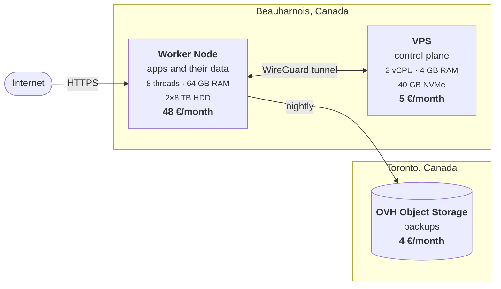

# k8s infrastructure

## Introduction

This repository contains the infrastructure configuration for my Kubernetes cluster, including all the manifests and documentation.


```mermaid
flowchart LR
    Internet(["Internet"])

    subgraph BHS["Beauharnois, Canada"]
        DED["<b>Worker Node</b><br/>apps and their data<br/><small>8 threads · 64 GB RAM<br/>2×8 TB HDD</small><br/><b>48 €/month</b>"]
        VPS["<b>VPS</b><br/>control plane<br/><small>2 vCPU · 4 GB RAM<br/>40 GB NVMe</small><br/><b>5 €/month</b>"]
    end

    subgraph TOR["Toronto, Canada"]
        S3[("<b>OVH Object Storage</b><br/>backups<br/><b>4 €/month</b>")]
    end

    Internet -->|HTTPS| DED
    DED <-->|WireGuard tunnel| VPS
    DED -->|nightly| S3
```

This cluster hosts personal services as well as client projects from my freelance business. All applications run on the main worker node, while the control plane runs on a separate VPS. This allows the worker node to be replaced without rebuilding the cluster, while the control plane’s NVMe storage keeps etcd fast.

### 🦙 Acknowledgment

[Sylvain Nérisson](https://people.epfl.ch/sylvain.nerisson) gave so much of his time to help me make the right design choices for this cluster, for which I’m incredibly grateful.

## 🚀 Apps

What do I host on this cluster?

* **Pro**: This namespace is for all the services hosted for me as a freelancer, such as Umami, HasteServer, Blog, DDPE, Diswho, Instaddict.
* **Home**: This namespace is for all the services hosted for my personal use such as Vaultwarden, TimeTagger, Immich, Monica, Mealie, FileBrowser.
* **Managed**: This namespace is for all the services hosted for my clients.
* **Sushiflix**: This namespace is for all media services such as Plex, Radarr, Sonarr, Bazarr, Jackett, Qbittorrent, Sabnzbd, Tautulli, Overseerr.
* **DB**: This namespace is for all the databases such as PostgreSQL, PgAdmin4.
* **Workflows**: This namespace is for all the workflows such as Harbor.
* **Monitoring**: This namespace is for all the monitoring services such as Grafana, Prometheus, Alertgram, Promtail and Loki.

## 📜 Wiki


### Backups

- 1 local snapshot of each volume every 30 minutes. Retained for 24 hours.
- 1 offsite backup (S3) of each volume every night. Retained for 30 days.

Movies and TV shows are not backed up, considered as non-critical data.

### Admin access

`kubectl`, `helm` and `k9s` run on the my laptop. The API server only listens on the WireGuard link (`10.8.0.1:6443`), so [`admin/k8s.zsh`](./admin/k8s.zsh) opens an SSH tunnel to the VPS whenever a command needs it (local port 16443) and uses its own kubeconfig, `~/.kube/k8s-infrastructure.yaml`. `kubectl port-forward` then opens ports on the Mac directly.

```sh
brew install kubernetes-cli helm kubeseal argocd
echo "source $PWD/admin/k8s.zsh" >> ~/.zshenv && source ~/.zshenv
k8s-login # personal admin certificate signed by the cluster CA, valid 1 year: run again to renew
k get pods -A
```

The certificate is named after the laptop user (`CN=$USER`, no group) and gets its rights from its own binding, created once per person. Kubernetes can't revoke a certificate: deleting the binding cuts off a lost laptop without touching the control plane's `admin.conf`.

```sh
ssh -i ~/.ssh/mbp2024 debian@148.113.245.134 "sudo kubectl --kubeconfig /etc/kubernetes/admin.conf create clusterrolebinding admin-$USER --clusterrole=cluster-admin --user=$USER"
k delete clusterrolebinding admin-<user>   # revoke
```

### Postgres roles

Each app in the shared `db/postgresql` connects with its own role, scoped to its own database(s). Never use the `postgres` superuser from a workload.

| Role        | Used by |
|-------------|---------|
| `bots`      | All `managed/*` Discord bots |
| `haste`     | `pro/haste-server` |
| `umami`     | `pro/umami-analytics` |
| `monica`    | `home/monica` |
| `shlink`    | `home/shlink` |
| `paperless` | `home/paperless` |
| `bonds`     | `home/bonds` |

### Sealed secrets

Secrets are committed encrypted with the controller's public key, [`sealed-secrets.crt`](./sealed-secrets.crt). Write a plain `Secret` in `secrets.yaml` (gitignored) with its `namespace` set, since the sealed version only opens there, then seal it:

```sh
kubeseal --scope namespace-wide --cert "$(git rev-parse --show-toplevel)/sealed-secrets.crt" -o yaml < secrets.yaml > sealed-secrets.yaml
```

Onechart's `sealedFileSecrets` take a raw value, sealed `cluster-wide`:

```sh
kubeseal --scope cluster-wide --cert "$(git rev-parse --show-toplevel)/sealed-secrets.crt" --raw --from-file=config.json
```

Reading one back needs the controller's private key (the `sealed-secrets-customkeys` Secret in `kube-system`): `kubeseal --recovery-unseal --recovery-private-key <key file> -o yaml < sealed-secrets.yaml`.

### Port forward (to a service or a pod)

```sh
kubectl -n somenamespace port-forward svc/someservice host-port:cluster-port`
```

### Internal-only services (port-forward to access)

Cluster-admin and DB-direct services that stay off the public internet. Port-forward them locally to access:

| Service | URL after forwarding | Command |
|---|---|---|
| Argo CD | http://localhost:8080 | `kubectl -n argocd port-forward svc/argocd-server 8080:80` |
| pgAdmin | http://localhost:8081 | `kubectl -n db port-forward svc/pgadmin-pgadmin4 8081:80` |

### Enter a pod

```sh
kubectl -n somenamespace exec --stdin --tty somepod -- /bin/bash
```

### Preview manifests created by Helm charts

```sh
helm template my-app repo-url/app -f values.yaml
```

Same for a `kustomization.yaml`. kubectl's kustomize still expects Helm 3 (it calls a flag Helm 4 removed), so point it at one:

```sh
brew install helm@3   # once, next to Helm 4
kubectl kustomize --enable-helm --helm-command "$(brew --prefix helm@3)/bin/helm" .
```

#### Disable backups for a specific volume

By default longhorn backups all volumes. Sometimes, for movies or other non-critical data, we don't want to backup the volume. In that case, you should add these labels to the volume:

```sh
labels:
    recurring-job-group.longhorn.io/nobackup: enabled
    recurring-job.longhorn.io/source: enabled
```

### Expand a Longhorn volume

Use port forwarding to access the Longhorn UI. ⚠️ First, sync the new PVC with Argo before expanding on Longhorn UI (or you will get a sync failed - `Forbidden: field can not be less than previous value`). Then delete all deployments using the volume. Then expand it via Longhorn UI.

### Add a TimeTagger user

Generate a `user:hash` pair on <https://timetagger.app/cred>. ⚠️ The page escapes `$` as `$$` for docker-compose: use a single `$` here (`$2a$08$...`, 60 characters), or the login fails.

Append it (comma-separated) to `TIMETAGGER_CREDENTIALS` in `cluster-manifests/home/timetagger/secrets.yaml`, [seal the secret](#sealed-secrets), merge, then restart the pod once ArgoCD has synced (env vars are only read at startup):

```sh
kubectl -n home rollout restart deploy/timetagger
```

### Setup Sushiflix

The Plex server has to be accessed locally to be claimed. Use port forwarding to access it first. Then we need to specify the custom domain name in the server network settings (advanced), and specify `plex.androz2091.fr`. Otherwise it will try to load data from `server-ip:32400` or even `cluster-ip:32400` which is not securely accessible.

### View logs

Logs are collected by Promtail/Loki and can be access via the dashboard available at [grafana/loki-dashboard.json](./grafana/loki-dashboard.json).

⚠️ Onechart labels all its apps with `onechart` so we have to differentiate them using the `instance` label.

## ⚒️ Setup

### Create the k8s cluster

```sh
apt update && sudo apt upgrade -y
apt-get install -y software-properties-common curl jq
```

Turn off swap.

```sh
swapoff -a
systemctl mask dev-sdb?.swap && systemctl stop dev-sdb?.swap # Debian special, check dans htop`
```

Prepare the node with Ansible. Always `--check --diff` first. Tasks are idempotent so a second run must report `changed=0`.

```sh
brew install ansible
ansible -i ansible/inventory.ini all -m ping 
ansible-playbook -i ansible/inventory.ini ansible/bootstrap.yaml --check --diff
ansible-playbook -i ansible/inventory.ini ansible/bootstrap.yaml --diff
```

Create the cluster from [`kubeadm/cluster-config.yaml`](./kubeadm/cluster-config.yaml), copied to the node first. It is the configuration the cluster stores in its `kubeadm-config` ConfigMap, keep the two identical. Each node then gets its own `/24` of the pod network `10.244.0.0/16`.

```sh
kubeadm init --config cluster-config.yaml --upload-certs
```

Configure kubectl CLI to connect to the cluster.

```sh
export KUBECONFIG=/etc/kubernetes/admin.conf
```

To add a node, run the playbook on it, then `kubeadm join` it with a fresh token from the control plane (`kubeadm token create --print-join-command`). A new control plane node only gets its taint at the end of the join: clean up the DaemonSet pods that landed on it meanwhile.

### Install a CNI plugin

Flannel gives each pod an IP and carries pod traffic between the nodes. Same version as the cluster, then pointed at the WireGuard tunnel (it takes the MTU from `wg0` by itself: 1370):

```sh
kubectl apply -f https://github.com/flannel-io/flannel/releases/download/v0.25.6/kube-flannel.yml
kubectl -n kube-flannel patch ds kube-flannel-ds --type=json -p '[{"op":"add","path":"/spec/template/spec/containers/0/args/-","value":"--iface=wg0"}]'
```

### Install Caddy

```sh
sudo apt install -y debian-keyring debian-archive-keyring apt-transport-https curl
curl -1sLf 'https://dl.cloudsmith.io/public/caddy/stable/gpg.key' | sudo gpg --dearmor -o /usr/share/keyrings/caddy-stable-archive-keyring.gpg
curl -1sLf 'https://dl.cloudsmith.io/public/caddy/stable/debian.deb.txt' | sudo tee /etc/apt/sources.list.d/caddy-stable.list
sudo apt update
sudo apt install caddy
```

Start Caddy (execute this command in the directory where the `Caddyfile` is located).

```sh
sudo caddy start
```

### Install Sealed Secrets

```sh
helm repo add sealed-secrets https://bitnami-labs.github.io/sealed-secrets
helm repo update
helm install sealed-secrets sealed-secrets/sealed-secrets --namespace kube-system --create-namespace --version 2.16.1
```

Create a public and private key.

```sh
export PRIVATEKEY="mytls.key"
export PUBLICKEY="mytls.crt"
export NAMESPACE="kube-system"
export SECRETNAME="sealed-secrets-customkeys"
```

⚠️ You may want to change the number of days for the expiration date.
```sh
openssl req -x509 -days 365 -nodes -newkey rsa:4096 -keyout "$PRIVATEKEY" -out "$PUBLICKEY" -subj "/CN=sealed-secret/O=sealed-secret"
```

Create the secret.

```sh
kubectl -n "$NAMESPACE" create secret tls "$SECRETNAME" --cert="$PUBLICKEY" --key="$PRIVATEKEY"
kubectl -n "$NAMESPACE" label secret "$SECRETNAME" sealedsecrets.bitnami.com/sealed-secrets-key=active
```

Delete the sealed-secrets controller pod to refresh the keys.

```sh
kubectl -n "$NAMESPACE" delete pod -l name=sealed-secrets-controller
```

See [bitnami-labs/sealed-secrets](https://github.com/bitnami-labs/sealed-secrets/blob/main/docs/bring-your-own-certificates.md#generate-a-new-rsa-key-pair-certificates).

### Install ArgoCD

```sh
kubectl create namespace argocd
helm repo add argo https://argoproj.github.io/argo-helm
helm repo update
helm install argocd argo/argo-cd --namespace argocd --create-namespace --values https://raw.githubusercontent.com/Androz2091/k8s-infrastructure/main/argocd-values.yaml --version 7.0.0
```

Get ArgoCD password.

```sh
kubectl -n argocd get secret argocd-initial-admin-secret -o jsonpath="{.data.password}" | base64 -d; echo
```

### Install Longhorn

```sh
apt-get install open-iscsi -y
helm repo add longhorn https://charts.longhorn.io
helm repo update
helm install longhorn longhorn/longhorn --namespace longhorn-system --create-namespace --version 1.7.3 --set persistence.defaultClassReplicaCount=1
```

`defaultClassReplicaCount=1`: one node, so one copy per volume (the chart default is 3). Upgraded from 1.7.0 on 2026-09-27, mainly for the fix of a CSI race that could reformat a volume on mount (longhorn#10416). The volumes' engines were left on 1.7.0. There is no downgrade, and `--reuse-values` would keep the old images:

```sh
helm repo update longhorn
helm upgrade longhorn longhorn/longhorn --namespace longhorn-system --version 1.7.3 --set persistence.defaultClassReplicaCount=1 --timeout 15m
```

(optional) forward the Longhorn UI to the host.

```sh
kubectl -n longhorn-system port-forward svc/longhorn-frontend 8080:80
```

Longhorn keeps every volume in `/var/lib/longhorn` on the node, so that disk is the cluster's storage.

### Execute bootstrap application

```sh
kubectl apply -f https://raw.githubusercontent.com/Androz2091/k8s-infrastructure/main/bootstrap-app.yaml
```

### Use k8s cluster DNS on the host

Disable `systemd-resolved` if it's running.

```sh
sudo systemctl disable systemd-resolved.service
sudo systemctl stop systemd-resolved.service
mv /etc/resolv.conf /etc/resolv.conf.bak
```

* update `/etc/resolv.conf` as follows:
```sh
nameserver 8.8.8.8
nameserver 10.96.0.10
```

Now we also need to update the cluster DNS so it does not loop back to the host.

* dump the current CoreDNS config:
```sh
kubectl -n kube-system get configmap coredns -o yaml > coredns_patched_dns.yaml
```

* edit the `coredns_patched_dns.yaml` file and add the following line to the `Corefile`:
```
forward . 1.1.1.1 8.8.8.8 {
	max_concurrent 1000
}
```

* then apply the changes by running:
```sh
kubectl apply -f coredns_patched_dns.yaml
```

### Create a secret to pull from Harbor

Do not forget the `\` before the `$` in the username.

```sh
kubectl -n managed create secret docker-registry regcred --docker-server=harbor.androz2091.fr --docker-username="robot\$name" --docker-password="secret_token"
```

### Configure Longhorn backups (OVH Object Storage)

Longhorn UI > `Settings` > `Backup Target`: `s3://longhornbackups@ca-east-tor/` (bucket `longhornbackups`, OVH region Toronto), credential secret `s3-secret`:

```sh
kubectl -n longhorn-system create secret generic s3-secret --from-literal=AWS_ACCESS_KEY_ID=<access_key> --from-literal=AWS_SECRET_ACCESS_KEY=<secret_key> --from-literal=AWS_ENDPOINTS=https://s3.ca-east-tor.io.cloud.ovh.net/ --from-literal=VIRTUAL_HOSTED_STYLE=true
```

A **snapshot** is the state of a volume at a point in time, stored in the cluster. A **backup** is a snapshot copied out of the cluster, to the backup target.

### Control Plane Node

Since 2026-09-27 the control plane runs on the VPS and `ns561436` is a plain worker. The nodes are set up by [`ansible/bootstrap.yaml`](./ansible/bootstrap.yaml), the cluster by [`kubeadm/cluster-config.yaml`](./kubeadm/cluster-config.yaml). Migration log: [README at `3cffd9d`](https://github.com/Androz2091/k8s-infrastructure/blob/3cffd9d/README.md#control-plane-node).

What the playbook doesn't do:

- each node's WireGuard key pair, generated once on the node (the public key goes in the inventory);
- restarting kube-proxy after `k8s_api_address` changes;
- starting the apps in small batches after a full restart (the HDDs saturate). Don't fully sync `immich` to restart its backup pod: the chart regenerates its Postgres password.


### Troubleshooting

#### Prometheus KubeClientCertificateExpiration

A client certificate used against the API server expires soon. kubeadm's own certificates last 1 year: check and renew them on the VPS, then restart the control plane pods so they load the new ones (the renewal restarts nothing, e.g. move their manifests out of `/etc/kubernetes/manifests` and back). kubelet renews its own certificate by itself; your admin certificate is renewed with `k8s-login`.

```sh
sudo kubeadm certs check-expiration
sudo kubeadm certs renew all
```

#### OpenSSL error

Understand why sometimes requests are terminated by a SSL error (1/5 requests for some services):
```sh
poca@localhost:~ (1) $ curl https://tautulli.androz2091.fr
curl: (35) OpenSSL/1.1.1l-fips: error:14094438:SSL routines:ssl3_read_bytes:tlsv1 alert internal error
```

Double check the `Caddyfile` and make sure that all the DNS are configured to the correct IP (sometimes when a SSL certificate fails to create/renew, such errors can occur **for all domains**).

Also... double check that `Caddy` is not started twice (see https://serverfault.com/questions/1167816/openssl-routinesssl3-read-bytestlsv1-alert-internal-error-with-kubernetes-and/1168625#1168625).

#### fsnotify watcher error

`kubectl logs -f` failing with `failed to create fsnotify watcher: too many open files` means the node ran out of inotify instances (Debian allows 128 per user, shared by every container running as that user). The playbook raises the limits on every node (`--tags kernel`).
